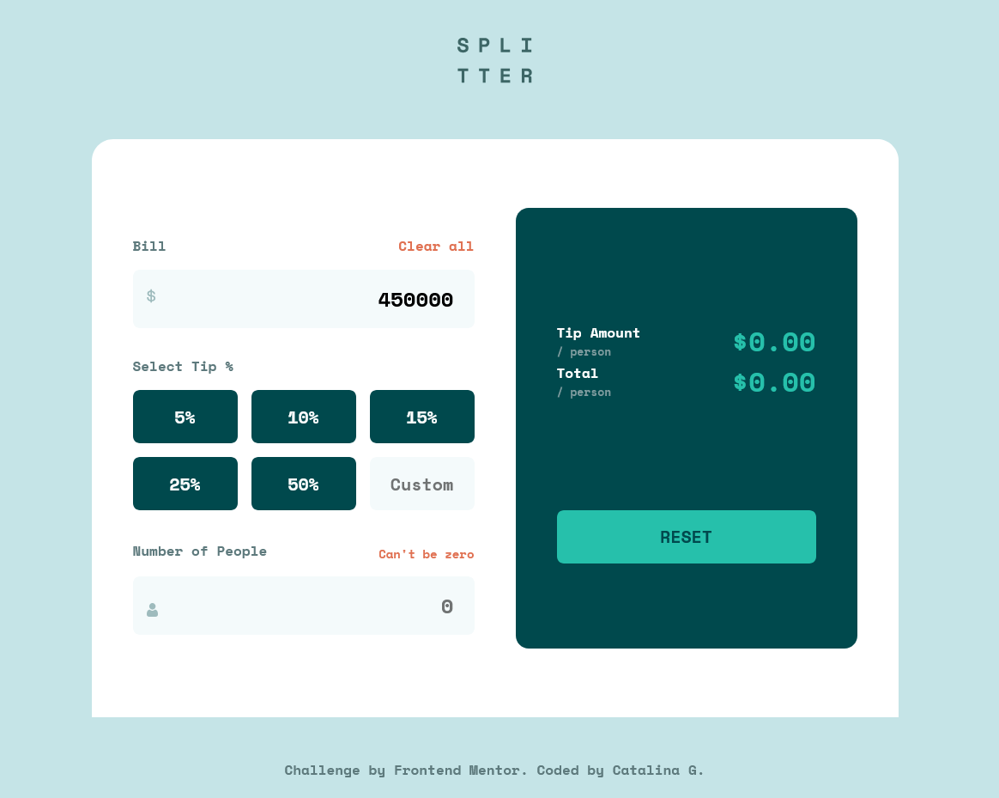

# Frontend Mentor - Tip calculator app solution

This is a solution to the [Tip calculator app challenge on Frontend Mentor](https://www.frontendmentor.io/challenges/tip-calculator-app-ugJNGbJUX). Frontend Mentor challenges help you improve your coding skills by building realistic projects.

## Overview

### The challenge

Users should be able to:

- View the optimal layout for the app depending on their device's screen size
- See hover states for all interactive elements on the page
- Calculate the correct tip and total cost of the bill per person

### Screenshot

### Links

- Solution URL:
- Live Site URL:

### Built with

- Semantic HTML5 markup
- CSS custom properties
- Flexbox
- CSS Grid
- Mobile-first workflow
- Vanila Javascript

### What I learned

Improved my JavaScript understanding and overall language usage, although there’s still a lot to improve.
I realized there are cleaner and more efficient ways to solve problems in JavaScript.
I need to work more on writing DRY (Don’t Repeat Yourself) code because I tend to overthink solutions and repeat logic unnecessarily.
Sometimes I create more code than needed, but I think that improves naturally with practice and experience.
One important thing for me right now is making sure the code still makes sense to me and that I understand what I’m writing.
I also learned more about:
validation
event listeners
variable scope
conditional logic
simplifying calculations
improving user experience by clearing errors dynamically

## Author

Catalina G.

**Note: Delete this note and add/remove/edit lines above based on what links you'd like to share.**
